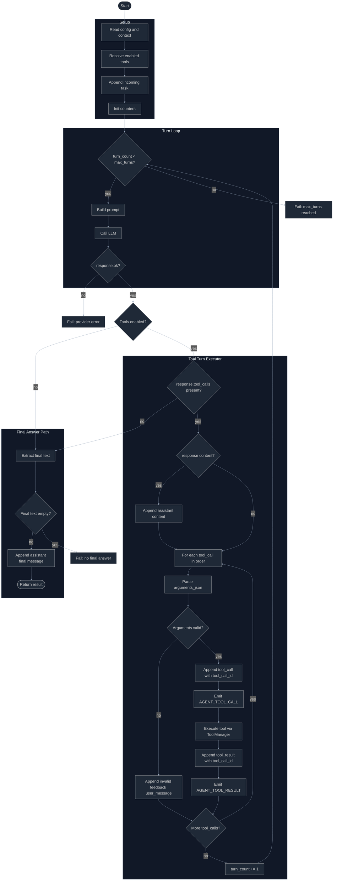

# Agent Flow

This document shows the current flow of `AgentRunner.execute(...)`.

## Status

Current implementation flow.

## Flow Diagram

## Notes

- The loop supports more than one native `tool_call` per response.
- One assistant response advances the turn counter once, after all tool calls are processed.
- Invalid tool calls append feedback and do not cancel other valid tool calls in the same response.
- Every executed tool call is correlated with `tool_call_id` in context and runtime events.
- Streaming is out of scope for the current `LLMPort` contract.

## Related Docs

- [`./agent-loop.md`](./agent-loop.md)
- [`./agent-event.md`](./agent-event.md)
- [`./agent-context.md`](./agent-context.md)
- [`../runtime/agent-architecture.md`](../runtime/agent-architecture.md)
