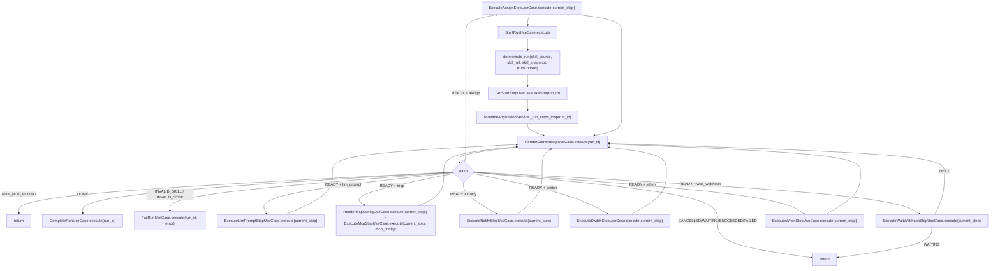

# Flujo actual de `run`

## Objetivo
Describir de forma breve el camino real de `RuntimeApplicationService.start_run(...)`.

## Fuente mantenida
El detalle operativo del runtime se mantiene en:

- `.codex/skills/skiller-dev/references/runtime-patterns.md`

Este documento queda como vista rápida del flujo.

## Diagrama

## Resumen
- `start_run` carga la skill, congela un snapshot y crea el run
- `GetStartStepUseCase` exige un step inicial con `id: start` y fija `run.current`
- `RenderCurrentStepUseCase` ya resuelve el step actual por `run.current`, no por indice
- en esta fase del refactor el loop canonico ya tiene migrados `notify`, `assign`, `switch`, `when`, `llm_prompt`, `mcp` y `wait_webhook`
- `notify`, `assign`, `switch`, `when`, `llm_prompt` y `mcp` avanzan con `next` implícito resuelto por el propio step o completan el run
- `wait_webhook` usa el mismo contrato de ejecución y puede devolver `NEXT`, `COMPLETED` o `WAITING`
- errores o estados inválidos terminan en `FailRunUseCase`
